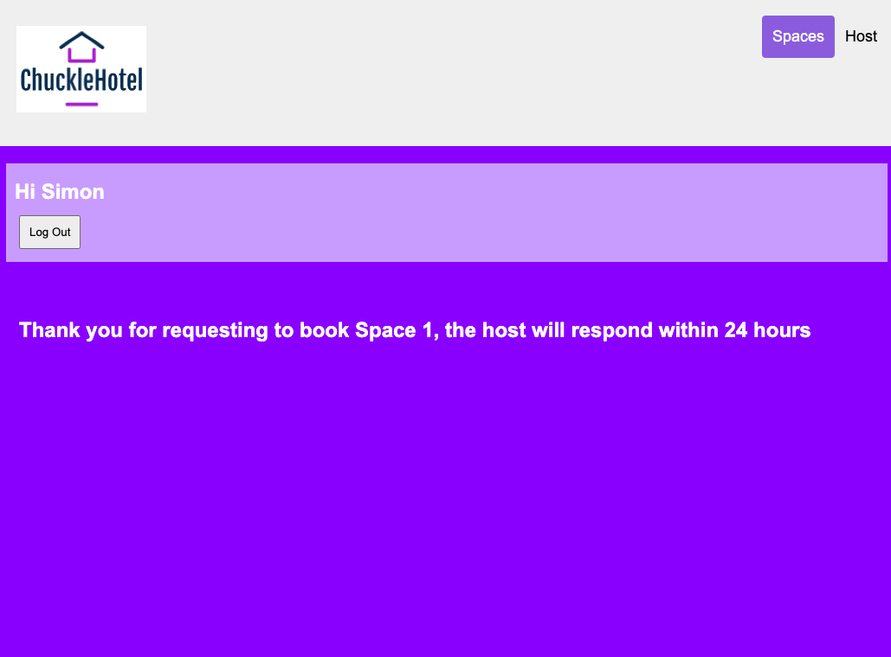
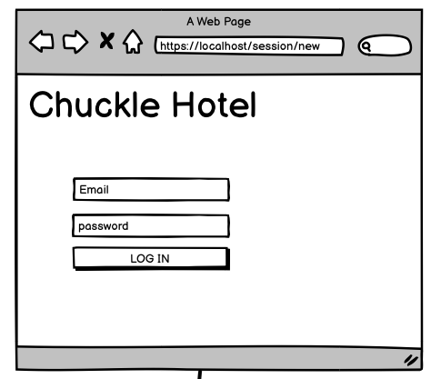

# Chuckle Brothers BnB

## Contributors
-------

- [Farzan Imanzadeh](https://github.com/Farzan-I)
- [George Dainton](https://github.com/GeorgeDainton)
- [Luke Storey](https://github.com/lukestorey95)
- [Simon Tinsley](https://github.com/sjtinsley)

## Project Description
-------
First engineering group project during Week 5 of the Makers hybrid course, we were tasked with developing an [AirBnB]() clone, known as Chuckle Hotel BnB (name our own choice). Within a team of 4 developers we developed this version that we're proud to present.

## Demo
-------
### Home page


### Log in page


### Signed in/Spaces page


### Space 1 information page


### Requested a booking page


### Host page


### Create space page


### Approve/Reject request page


### Accepting request page


### Rejecting request page


### Rejecting request page


### Log out success flash message on home page


### Error flash message on home page


## Technologies Used
------

- [Ruby](https://ruby-lang.org/en/) web framework.
- [Sinatra](https://sinatrarb.com/) creating web applications using Ruby.
- [PostgreSQL](https://www.postgresql.org/) to store our data.
- [Capybara](https://teamcapybara.github.io/capybara/) to test our framework.
- [Rubocop](https://rubocop.org/) for linting.
- [Rspec](https://rspec.info/) for testing our backend code.
- [CSS](https://www.w3.org/Style/CSS/Overview.en.html) for styling of the webpages.
- [Balsamiq](https://balsamiq.cloud/) for wireframing.
- [Trello](https://trello.com/en) for assigning tickets within the team.

## How to run locally
-------
### Set-up Project
1. Run `bundle`
2. Set-up database using `psql` in command line
3. Create database `chuckle_hotel` using `CREATE DATABASE`
4. Create spaces table using the instructions in the db/migrations folder
5. Repeat steps 3 and 4 for `chuckle_hotel_test` database

### Set-up Website
1. Type `rerun rackup` in project directory within command line to start the server
2. Open a browser window and type `localhost:9292` to access the home page

## Card wall
--------
We used a [Trello](https://trello.com/b/uYu4xPta/project-board) board to keep track of the features we want to implement. We organised tickets amongst the team and moved the tickets accordingly to demonstrate at what stage that feature's at (To do/In progress/In review etc.).

## Wireframes
-------
### Home page concept

### View a space concept

### Add a space concept

### Add space details concept

### Host can accept/reject concept

### User can request to book a space concept

### Host can update space availability concept

### User can only book available dates concept


## Team approach
---------
* Standups every morning at 10:00am
* Retro at 5:30pm every evening
* Pair programming throughout the entire project (driver/navigator roles)
* Regular check-ins with team members to make sure nobody was left behind
* Trello board for distributing work and staying on track

## User Stories
-------
### Login/out
```
As a user
So that I can interact with the website
I want to be able to log in
```
```
As a user
So that I can prevent anyone else from using my account
I want to be able to log out
```
```
As a host
So that I can list my space
I want to be able to create an account
```
```
As a guest
So that I can book a space
I want to be able to create an account
```

### Space functionality
```
As a host
So that I can allow my spaces to be booked
I want to be able to set a range of available dates
```
```
As a host
So that I can decide whether to allow users to book my space
I want to be able to approve or deny a booking request
```
```
As a host
So that I can list my space on the website
I want to fill in the details of my space and submit
```
```
As a guest,
So that I can stay the night in a space
I want to be able to send a booking request
```
```
As a user
So that I can decide whether to hire a space
I want to be able to see the details of the space
```
```
As a user
So that I can choose whether to hire a space
I want to be able to view the available spaces
```
```
As a user
So that I can list my own spaces
I want to be able to create a space from my own account
```

### User privacy
```
As a user
So that I can keep my password private
I want it to be hashed when it's stored with ChuckleH
```

## MVP
------
* User can sign up, log in and log out
* User can view an available space
* User can view an available space's details
* User can list a space
* User can request to hire a space

## Edge cases
-------
* Sign up with invalid input
* Sign in with invalid input
* Try to access spaces page when logged out

## Future improvements
--------
* User cannot sign up with an already used email
* Spaces can have a picture uploaded to them to show what a user can book
* User can only book available dates (user story below)
```
As a user
So I can only book available properties
I want to see an error message if the date I select is unavailable
```
* Host can update space availability (user story below)
```
As a host
So that I can change availability of my spaces
I want to be able to update availability after a space has been created
```
